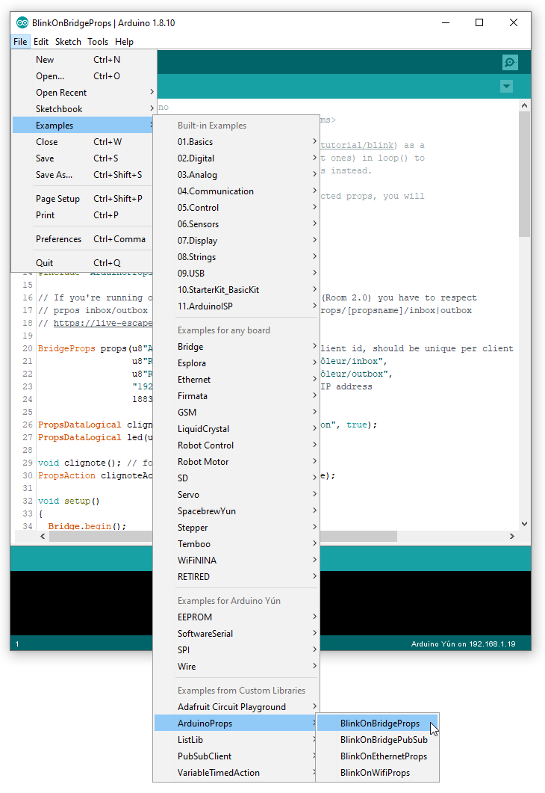

# ArduinoProps library examples
An adaptation of the internal led Blink example (https://www.arduino.cc/en/tutorial/blink) as a simple MQTT prop. 

1. [**BlinkOnBridgeProp**](#1-blinkonbridgeprop-the-blink-example-on-a-yun-prop-with-arduinoprops-library): the Blink example on a Yun prop with *ArduinoProps library*
2. [**BlinkOnEthernetProp**](#2-blinkonethernetprop-the-blink-example-on-an-ethernet-prop-with-arduinoprops-library): the Blink example on an Ethernet prop with *ArduinoProps library*
3. [**BlinkOnWifiProp**](#3-blinkonwifiprop-the-blink-example-on-a-wifi-prop-with-arduinoprops-library): the Blink example on a Wifi prop with *ArduinoProps library*
4. [**BlinkOnBridgePubSub**](#4-blinkonbridgepubsub-the-blink-example-on-prop-using-pubsubclient-directly): the Blink example on prop using *PubSubClient* directly
5. [**BlinkOnStm32Nucleo144Prop**](#5-blinkonstm32nucleo144prop-the-blink-example-on-an-stm32-nucleo-144-prop-with-arduinoprops-library): the Blink example on an STM32 Nucleo-144 prop with *ArduinoProps library*

MQTT messages are received asynchronously therefore to keep the sketch responsive to MQTT commands, calls to delay() should be avoided (except short ones, say < 100 milliseconds).

With *Prop* class, the prop code is more readable because all MQTT *PubSubClient* stuff are hidden in *Prop* calls, therefore the prop code is easier to write and maintain.

Asynchronous-like behavior is obtained using *PropAction*, *TimedAction* or *VariableTimedAction*.

***Copy and change any of these sketches to build your own Arduino connected prop, you will only be limited by your imagination.***


## 1. *BlinkOnBridgeProp*: the Blink example on a Yun prop with *ArduinoProps library*

The library comes with a number of example sketches. See **File > Examples > ArduinoProps** within the Arduino IDE application after installing the *ArduinoProps* library from the  `.zip` file.



```csharp
/* BlinkOnBridgeProp.ino
   MIT License (c) Faure Systems <dev at faure dot systems>

   Adapt the Blink example (https://www.arduino.cc/en/tutorial/blink) as a
   simple MQTT prop. Avoid delay() calls (except short ones) in loop() to
   ensure CPU for MQTT protocol. Use PropAction checks instead.

   Copy and change it to build your first Arduino connected prop, you will
   only be limited by your imagination.

   Requirements: install ArduinoProps.zip library.
*/
#include <Bridge.h>
#include "ArduinoProps.h"

// If you're running our Escape Room control software (Room 2.0) you have to respect
// prpos inbox/outbox syntax Room/[escape room name]/Props/[prop name]/inbox|outbox
// https://live-escape.net/go/room

BridgeProp prop(u8"Arduino Contrôleur", // as MQTT client id, should be unique per client for given broker
                  u8"Room/Demoniak/Props/Arduino Contrôleur/inbox",
                  u8"Room/Demoniak/Props/Arduino Contrôleur/outbox",
                  "192.168.1.42", // your MQTT server IP address
                  1883); // your MQTT server port;

PropDataLogical clignoter(u8"clignote", u8"oui", u8"non", true);
PropDataLogical led(u8"led");

void clignote(); // forward
PropAction clignoteAction = PropAction(1000, clignote);

void setup()
{
  Bridge.begin();
  //updateBrokerAdressFromFile("/root/broker", &prop); // if you're running our Escape Room control software (Room 2.0)

  prop.addData(&clignoter);
  prop.addData(&led);

  prop.begin(InboxMessage::run);

  pinMode(LED_BUILTIN, OUTPUT); // initialize digital pin LED_BUILTIN as an output

  // At this point, the broker is not connected yet
}

void loop()
{
  prop.loop();

  led.setValue(digitalRead(LED_BUILTIN)); // read I/O

  clignoteAction.check(); // do your stuff, don't freeze the loop with delay() calls
}

void clignote()
{
  if (clignoter.value()) {
    led.setValue(!led.value());
    digitalWrite(LED_BUILTIN, led.value() ? HIGH : LOW);
  }
}

void InboxMessage::run(String a) {

  if (a == u8"app:startup")
  {
    prop.sendAllData();
    prop.sendDone(a);
  }
  else if (a == "clignoter:1")
  {
    clignoter.setValue(true);

    prop.sendAllData(); // all data change, we don't have to be selctive then
    prop.sendDone(a); // acknowledge prop command action
  }
  else if (a == "clignoter:0")
  {
    clignoter.setValue(false);

    prop.sendAllData(); // all data change, we don't have to be selctive then
    prop.sendDone(a); // acknowledge prop command action
  }
  else
  {
    // acknowledge omition of the prop command
    prop.sendOmit(a);
  }
}

void updateBrokerAdressFromFile(const char* broker_file, BridgeProp* prop)
{
  // broker IP address is stored in Linino file systems and updated with ssh command by Room 2.0
  IPAddress ip;

  Process _process;
  _process.begin("cat");
  _process.addParameter(broker_file); // for ssh remotely set broker address
  _process.run(); // run the process and wait for its termination
  String b;
  while (_process.available() > 0) {
    char c = _process.read();
    b += c;
  }
  b.trim();

  if (ip.fromString(b.c_str())) prop->setBrokerIpAddress(ip);
}

```

### Memory imprint on Arduino Yun: 
```bash
The sketch uses 16752 bytes (58%) of the program storage space. The maximum is 28672 bytes.
Global variables use 1120 bytes (43%) of dynamic memory, which leaves 1438 bytes for local variables. The maximum is 2560 bytes.

```

### Memory imprint on Dragino Yun + Arduino Mega 2560: 
```bash
The sketch uses 14060 bytes (5%) of the program storage space. The maximum is 258048 bytes.
Global variables use 980 bytes (11%) of dynamic memory, which leaves 7210 bytes for local variables. The maximum is 8192 bytes.

```


## 2. *BlinkOnEthernetProp*: the Blink example on an Ethernet prop with *ArduinoProps library*

Sketch with *EthernetProp* differs slightly from code with *BridgeProp*.

#### Pay atention to the board MAC address:
MAC adresses are hardware identifiers on the network so they must be unique.

A good practice is to increment only the byte at the very right (`0x03`) when adding a new Arduino Ethernet on your network.

```csharp
byte mac[] = { 0x46, 0x4F, 0xEA, 0x10, 0x20, 0x03 }; //<<< MAKE SURE IT'S UNIQUE IN YOUR NETWORK!!! and not a reserved MAC

```


## 3. *BlinkOnWifiProp*: the Blink example on a Wifi prop with *ArduinoProps library*

Sketch with *WifiProp* differs slightly from code with *BridgeProp*.

#### The board WiFiNINA firmware must be recent (> 1.0):
Uupdating WiFiNINA firmware is easy: [WiFiNINA firmware update](help/WifiNinaFirmware.md).


#### WiFi connection is done in loop():
To properly handle WiFi disconnections, the connection state must be tested and managed in the loop:
```csharp
void loop()
{
  if (!wifiBegun) {
    WiFi.begin(ssid, passphrase);
    Serial.println(WiFi.firmwareVersion());
    delay(250); // acceptable freeze for this prop (otherwise use PropAction for async-like behavior)
    // do static IP configuration disabling the dhcp client, must be called after every WiFi.begin()
    String fv = WiFi.firmwareVersion();
    if (fv.startsWith("1.0")) {
      Serial.println("Please upgrade the firmware for static IP");
      // see https://github.com/fauresystems/ArduinoProps/blob/master/WifiNinaFirmware.md
    }
    else {
      //WiFi.config(IPAddress(192, 168, 1, 21), // local_ip
      //	IPAddress(192, 168, 1, 1),  // dns_server
      //	IPAddress(192, 168, 1, 1),  // gateway
      //	IPAddress(255, 255, 255, 0)); // subnet
    }
    if (WiFi.status() == WL_CONNECTED) {
      wifiBegun = true;
      Serial.println(WiFi.localIP());
      Serial.println(WiFi.subnetMask());
      Serial.println(WiFi.gatewayIP());
    } else {
      WiFi.end();
    }
  } else if (wifiBegun && WiFi.status() != WL_CONNECTED) {
    WiFi.end();
    wifiBegun = false;
  }

  prop.loop();

  led.setValue(digitalRead(LED_BUILTIN)); // read I/O

  clignoteAction.check(); // do your stuff, don't freeze the loop with delay() calls
}
```


## 4. *BlinkOnBridgePubSub*: the Blink example on prop using *PubSubClient* directly

Using *PubSubClient* directly does not save much memory and makes the sketch code less readable, the processing code will be a bit lost in the MQTT code

However, this can help in special cases.

```csharp
/*
 Name:		BlinkOnBridgePubSub.ino
 Author:	Faure Systems <dev at faure dot systems>
 Editor:	https://github.com/fauresystems
 License:	MIT License (c) Faure Systems <dev at faure dot systems>

 Adapt the Blink example (https://www.arduino.cc/en/tutorial/blink) as a
 simple MQTT prop with PubSubClient.
*/
#include <Bridge.h>
#include <BridgeClient.h>
#include <Process.h>
#include <PubSubClient.h>
#include <VariableTimedAction.h>

#define BROKER          "192.168.1.42" // your MQTT server IP address
#define PROP_NAME      u8"Arduino Contrôleur" // as MQTT client id, should be unique per client for given broker

// If you're running our Escape Room control software (Room 2.0) you have to respect
// prop inbox/outbox syntax Room/[escape room name]/Props/[prop name]/inbox|outbox
// https://github.com/fauresystems/escape-room#room-control-software
#define PROP_INBOX     u8"Room/Demoniak/Props/Arduino Contrôleur/inbox"
#define PROP_OUTBOX    u8"Room/Demoniak/Props/Arduino Contrôleur/outbox"

// Yun can store broker IP address in Linino file systems, and updatred with ssh command
#define YUN_BROKER_FILE "/root/broker"

void publishAll(); // forward
void publishChanges(); // forward

class Blinking : public VariableTimedAction {
private:
	//this method will be called at your specified interval
	unsigned long run() {
		//swicth LED if blinking mode
		if (blink) {
			digitalWrite(LED_BUILTIN, !digitalRead(LED_BUILTIN));
		}

		//return code of 0 indicates no change to the interval
		//if the interval must be changed, then return the new interval
		return 0;
	}

public:
	bool blink;
};

class PublishAllData : public VariableTimedAction {
private:
	unsigned long run() {
		publishAll();
		return 0;
	}
};

class PublishChangedData : public VariableTimedAction {
private:
	unsigned long run() {
		publishChanges();
		return 0;
	}
};

Blinking blinking;

bool led_ref;
bool blink_ref;

BridgeClient _ethClient;
PubSubClient _client(_ethClient);
IPAddress _brokerAddress;

void callback(char*, byte*, unsigned int); // forward

// MQTT
unsigned long lastReconnection(0L);
PublishAllData publishAllData;
PublishChangedData publishChangedData;

void setup()
{
	Bridge.begin();

	Process p;
	p.begin("cat");
	p.addParameter(YUN_BROKER_FILE);
	p.run(); // run the process and wait for its termination
	String b;
	while (p.available() > 0) {
		char c = p.read();
		b += c;
	}
	b.trim();

	if (!_brokerAddress.fromString(b.c_str())) _brokerAddress.fromString(BROKER);
	_client.setServer(_brokerAddress, 1883);
	_client.setCallback(callback);

	publishAllData.start(30000);
	publishChangedData.start(400);

	blinking.blink = true;
	blinking.start(1000);
	blink_ref = false;

	pinMode(LED_BUILTIN, OUTPUT); // initialize digital pin LED_BUILTIN as an output
	digitalWrite(LED_BUILTIN, HIGH);
	led_ref = LOW;

	// At this point, the broker is not connected yet
}

void loop()
{
	if (_client.connected())
	{
		_client.loop();
	}
	else if (millis() > lastReconnection)
	{
		lastReconnection += 5000L;

		if (_client.connect(PROP_NAME, PROP_OUTBOX, 2, true, "DISCONNECTED"))
		{
			_client.publish(PROP_OUTBOX, "CONNECTED", true);
			_client.subscribe(PROP_INBOX, 1); // max QoS is 1 for PubSubClient subsciption
			lastReconnection = 0L;
		}
	}

	// automation code should be here (nothing to do for this example)

	VariableTimedAction::updateActions();
}

void publishAll()
{
	String buf = "DATA";

	bool led = digitalRead(LED_BUILTIN);

	buf += u8" led=" + (led ? String("1") : String("0"));
	led_ref = led;

	buf += u8" clignote=" + (blinking.blink ? String("oui") : String("non"));
	blink_ref = blinking.blink;

	_client.publish(PROP_OUTBOX, buf.c_str());
}

void publishChanges()
{
	String buf = "DATA";

	bool led = digitalRead(LED_BUILTIN);

	if (led != led_ref)
	{
		buf += u8" led=" + (led ? String("1") : String("0"));
		led_ref = led;
	}

	if (blinking.blink != blink_ref)
	{
		buf += u8" clignote=" + (blinking.blink ? String("oui") : String("non"));
		blink_ref = blinking.blink;
	}

	if (buf.length() > 4)
		_client.publish(PROP_OUTBOX, buf.c_str());
}

void publishDone(String a)
{
	a = "DONE " + a;
	_client.publish(PROP_OUTBOX, a.c_str());
}

void onInboxMessage(String a) {

	if (a == u8"app:startup")
	{
		publishAll();
		publishDone(a);
	}
	else if (a == "clignoter:1")
	{
		digitalWrite(LED_BUILTIN, HIGH);
		blinking.blink = true;

		publishAll(); // all data change, we don't have to be selctive then
		publishDone(a); // acknowledge prop command action
	}
	else if (a == "clignoter:0")
	{
		digitalWrite(LED_BUILTIN, LOW);
		blinking.blink = false;

		publishAll(); // all data change, we don't have to be selctive then
		publishDone(a); // acknowledge prop command action
	}
	else
	{
		// acknowledge omition of the prop command
		_client.publish(PROP_OUTBOX, String("OMIT " + a).c_str());
	}
}

void callback(char* topic, byte* payload, unsigned int len)
{
	if (len)
	{
		char* p = (char*)malloc(len + 1);
		memcpy(p, payload, len);
		p[len] = '\0';
		if (String(p) == "@PING")
			_client.publish(PROP_OUTBOX, "PONG");
		else
			onInboxMessage(p);
		free(p);
	}
}

```

### Memory imprint on Arduino Yun: 
```bash
The sketch uses 15930 bytes (55%) of the program storage space. The maximum is 28672 bytes.
Global variables use 1013 bytes (39%) of dynamic memory, which leaves 1547 bytes for local variables. The maximum is 2560 bytes.

```


## 5. *BlinkOnStm32Nucleo144Prop*: the Blink example on an STM32 Nucleo-144 prop with *ArduinoProps library*

*BlinkOnStm32Nucleo144Prop* sketch has been derived *BlinkOnEthernetProp*.

Includes for STM32 are different:
```c
#include <LwIP.h>
#include <STM32Ethernet.h>
#include "Stm32Nucleo144Prop.h"
#include "ArduinoProps.h"
#include "Stm32Millis.h"
extern Stm32MillisClass Stm32Millis;
```

`millis()` is missing in STM323duino library, you must start **Stm32Millis** in `setup()`:
```c
  // millis() missing in STM32duino
  Stm32Millis.begin();
```

Ethernet connection start is slightly different:
```c
  if (ip == IPAddress(0,0,0,0)) {
    if (!Ethernet.begin(mac)) {
      // if DHCP fails, start with a hard-coded address:
      Ethernet.begin(mac, IPAddress(10, 90, 90, 239));
    }
  }
  else {
    Ethernet.begin(mac, ip);
  }
```


#### Pay atention to the board MAC address:
MAC adresses are hardware identifiers on the network so they must be unique.

A good practice is to increment only the byte at the very right (`0x03`) when adding a new Arduino Ethernet on your network.

```csharp
byte mac[] = { 0x46, 0x4F, 0xEA, 0x10, 0x20, 0x03 }; //<<< MAKE SURE IT'S UNIQUE IN YOUR NETWORK!!! and not a reserved MAC

```


## Author

**Faure Systems** (Jun 25th, 2019)
* company: FAURE SYSTEMS SAS
* mail: *dev at faure dot systems*
* github: <a href="https://github.com/fauresystems?tab=repositories" target="_blank">fauresystems</a>
* web: <a href="https://faure.systems/" target="_blank">Faure Systems</a>