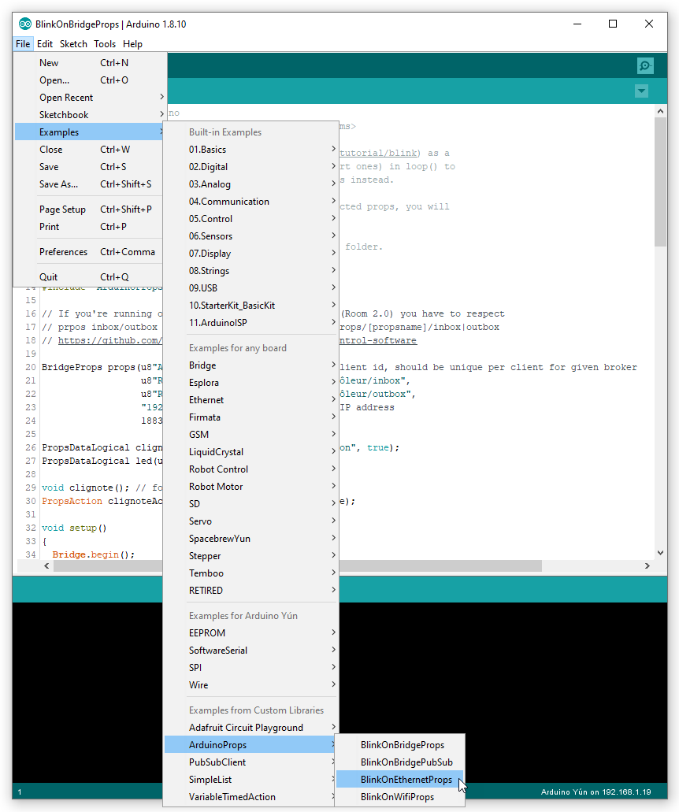

# ArduinoProps library examples
An adaptation of the internal led Blink example (https://www.arduino.cc/en/tutorial/blink) as a simple MQTT props. 

1. **BlinkOnBridgeProps**: the Blink example on a Yun props with *ArduinoProps library*
2. **BlinkOnEthernetProps**: the Blink example on an Ethernet props with *ArduinoProps library*
3. **BlinkOnWifiProps**: the Blink example on a Wifi props with *ArduinoProps library*
4. **BlinkOnBridgePubSub**: the Blink example on props using *PubSubClient* directly

MQTT messages are received asynchronously therefore to keep the sketch responsive to MQTT commands, calls to delay() should be avoided (except short ones, say < 100milliseconds).

Asynchronous-like behavior is obtained using *PropsAction*, *TimedAction* or *VariableTimedAction*.

*Copy and change any of these sketches to build your own Arduino connected props, you will only be limited by your imagination.*


## 1. *BlinkOnBridgeProps*: the Blink example on a Yun props with *ArduinoProps library*

With *Props* class, the code is the most readable. All MQTT stuff are hidden in *Props* calls, your processing code is easier to write and maintain.

```csharp
/* BlinkOnBridgeProps.ino
   MIT License (c) Marie Faure <dev at faure dot systems>

   Adapt the Blink example (https://www.arduino.cc/en/tutorial/blink) as a
   simple MQTT props. Avoid delay() calls (except short ones) in loop() to
   ensure CPU for MQTT protocol. Use PropsAction checks instead.

   Copy and change it to build your fist Arduino connected props, you will
   only be limited by your imagination.

   Requirements: install ArduinoProps.zip library.
*/
#include <Bridge.h>
#include "ArduinoProps.h"

// If you're running our Escape Room control software (Room 2.0) you have to respect
// prpos inbox/outbox syntax Room/[escape room name]/Props/[propsname]/inbox|outbox
// https://live-escape.net/go/room

BridgeProps props(u8"Arduino Contrôleur", // as MQTT client id, should be unique per client for given broker
                  u8"Room/Demoniak/Props/Arduino Contrôleur/inbox",
                  u8"Room/Demoniak/Props/Arduino Contrôleur/outbox",
                  "192.168.1.42", // your MQTT server IP address
                  1883); // your MQTT server port;

PropsDataLogical clignoter(u8"clignote", u8"oui", u8"non", true);
PropsDataLogical led(u8"led");

void clignote(); // forward
PropsAction clignoteAction = PropsAction(1000, clignote);

void setup()
{
  Bridge.begin();
  //updateBrokerAdressFromFile("/root/broker", &props); // if you're running our Escape Room control software (Room 2.0)

  props.addData(&clignoter);
  props.addData(&led);

  props.begin(InboxMessage::run);

  pinMode(LED_BUILTIN, OUTPUT); // initialize digital pin LED_BUILTIN as an output

  // At this point, the broker is not connected yet
}

void loop()
{
  props.loop();

  led.setValue(digitalRead(LED_BUILTIN)); // read I/O

  clignoteAction.check(); // do your stuff, don't freeze the loop with delay() calls
}

void clignote()
{
  if (clignoter.value()) {
    led.setValue(!led.value());
    digitalWrite(LED_BUILTIN, led.value() ? HIGH : LOW);
  }
}

void InboxMessage::run(String a) {

  if (a == u8"app:startup")
  {
    props.sendAllData();
    props.sendDone(a);
  }
  else if (a == "clignoter:1")
  {
    clignoter.setValue(true);

    props.sendAllData(); // all data change, we don't have to be selctive then
    props.sendDone(a); // acknowledge props command action
  }
  else if (a == "clignoter:0")
  {
    clignoter.setValue(false);

    props.sendAllData(); // all data change, we don't have to be selctive then
    props.sendDone(a); // acknowledge props command action
  }
  else
  {
    // acknowledge omition of the props command
    props.sendOmit(a);
  }
}

void updateBrokerAdressFromFile(const char* broker_file, BridgeProps* props)
{
  // broker IP address is stored in Linino file systems and updated with ssh command by Room 2.0
  IPAddress ip;

  Process _process;
  _process.begin("cat");
  _process.addParameter(broker_file); // for ssh remotely set broker address
  _process.run(); // run the process and wait for its termination
  String b;
  while (_process.available() > 0) {
    char c = _process.read();
    b += c;
  }
  b.trim();

  if (ip.fromString(b.c_str())) props->setBrokerIpAddress(ip);
}

```

### Memory imprint on Arduino Yun: 
```bash
The sketch uses 16720 bytes (58%) of the program storage space. The maximum is 28672 bytes.
Global variables use 1122 bytes (43%) of dynamic memory, which leaves 1438 bytes for local variables. The maximum is 2560 bytes.

```

### Memory imprint on *Dragino Yun + Arduino Mega 2560: 
```bash
The sketch uses 14030 bytes (5%) of the program storage space. The maximum is 258048 bytes.
Global variables use 982 bytes (11%) of dynamic memory, which leaves 7210 bytes for local variables. The maximum is 8192 bytes.

```


## 2. *BlinkOnEthernetProps*: the Blink example on an Ethernet props with *ArduinoProps library*

Sketch with *EthernetProps* differs slightly from code with *BridgeProps*.

The library comes with a number of example sketches. See **File > Examples > ArduinoProps** within the Arduino IDE application after installing the *ArduinoProps* library from the  `.zip` file.



## 3. *BlinkOnWifiProps*: the Blink example on a Wifi props with *ArduinoProps library*

Sketch with *WifiProps* differs slightly from code with *BridgeProps*.

Please update the WiFiNINA firmware: [WiFiNINA firmware update](WifiNinaFirmware.md).


## 4. *BlinkOnBridgePubSub*: the Blink example on props using *PubSubClient* directly

Using *PubSubClient* directly does not save much memory and makes the sketch code less readable, the processing code will be a bit lost in the MQTT code

However, this can help in special cases.

```csharp
/*
 Name:		BlinkOnBridgePubSub.ino
 Created:	29/10/2019 16:51:55
 Author:	Marie Faure <dev at faure dot systems>
 Editor:	https://github.com/fauresystems
 License:	MIT License (c) Marie Faure <dev at faure dot systems>

 Adapt the Blink example (https://www.arduino.cc/en/tutorial/blink) as a
 simple MQTT props with PubSubClient.
*/
#include <Bridge.h>
#include <BridgeClient.h>
#include <Process.h>
#include <PubSubClient.h>
#include <VariableTimedAction.h>

#define BROKER          "192.168.1.42" // your MQTT server IP address
#define PROPS_NAME      u8"Arduino Contrôleur" // as MQTT client id, should be unique per client for given broker

// If you're running our Escape Room control software (Room 2.0) you have to respect
// props inbox/outbox syntax Room/[escape room name]/Props/[propsname]/inbox|outbox
// https://github.com/fauresystems/escape-room#room-control-software
#define PROPS_INBOX     u8"Room/Demoniak/Props/Arduino Contrôleur/inbox"
#define PROPS_OUTBOX    u8"Room/Demoniak/Props/Arduino Contrôleur/outbox"

// Yun can store broker IP address in Linino file systems, and updatred with ssh command
#define YUN_BROKER_FILE "/root/broker"

void publishAll(); // forward
void publishChanges(); // forward

class Blinking : public VariableTimedAction {
private:
	//this method will be called at your specified interval
	unsigned long run() {
		//swicth LED if blinking mode
		if (blink) {
			digitalWrite(LED_BUILTIN, !digitalRead(LED_BUILTIN));
		}

		//return code of 0 indicates no change to the interval
		//if the interval must be changed, then return the new interval
		return 0;
	}

public:
	bool blink;
};

class PublishAllData : public VariableTimedAction {
private:
	unsigned long run() {
		publishAll();
		return 0;
	}
};

class PublishChangedData : public VariableTimedAction {
private:
	unsigned long run() {
		publishChanges();
		return 0;
	}
};

Blinking blinking;

bool led_ref;
bool blink_ref;

BridgeClient _ethClient;
PubSubClient _client(_ethClient);
IPAddress _brokerAddress;

void callback(char*, byte*, unsigned int); // forward

// MQTT
unsigned long lastReconnection(0L);
PublishAllData publishAllData;
PublishChangedData publishChangedData;

void setup()
{
	Bridge.begin();

	Process p;
	p.begin("cat");
	p.addParameter(YUN_BROKER_FILE);
	p.run(); // run the process and wait for its termination
	String b;
	while (p.available() > 0) {
		char c = p.read();
		b += c;
	}
	b.trim();

	if (!_brokerAddress.fromString(b.c_str())) _brokerAddress.fromString(BROKER);
	_client.setServer(_brokerAddress, 1883);
	_client.setCallback(callback);

	publishAllData.start(30000);
	publishChangedData.start(400);

	blinking.blink = true;
	blinking.start(1000);
	blink_ref = false;

	pinMode(LED_BUILTIN, OUTPUT); // initialize digital pin LED_BUILTIN as an output
	digitalWrite(LED_BUILTIN, HIGH);
	led_ref = LOW;

	// At this point, the broker is not connected yet
}

void loop()
{
	if (_client.connected())
	{
		_client.loop();
	}
	else if (millis() > lastReconnection)
	{
		lastReconnection += 5000L;

		if (_client.connect(PROPS_NAME, PROPS_OUTBOX, 2, true, "DISCONNECTED"))
		{
			_client.publish(PROPS_OUTBOX, "CONNECTED", true);
			_client.subscribe(PROPS_INBOX, 1); // max QoS is 1 for PubSubClient subsciption
			lastReconnection = 0L;
		}
	}

	// automation code should be here (nothing to do for this example)

	VariableTimedAction::updateActions();
}

void publishAll()
{
	String buf = "DATA";

	bool led = digitalRead(LED_BUILTIN);

	buf += u8" led=" + (led ? String("1") : String("0"));
	led_ref = led;

	buf += u8" clignote=" + (blinking.blink ? String("oui") : String("non"));
	blink_ref = blinking.blink;

	_client.publish(PROPS_OUTBOX, buf.c_str());
}

void publishChanges()
{
	String buf = "DATA";

	bool led = digitalRead(LED_BUILTIN);

	if (led != led_ref)
	{
		buf += u8" led=" + (led ? String("1") : String("0"));
		led_ref = led;
	}

	if (blinking.blink != blink_ref)
	{
		buf += u8" clignote=" + (blinking.blink ? String("oui") : String("non"));
		blink_ref = blinking.blink;
	}

	if (buf.length() > 4)
		_client.publish(PROPS_OUTBOX, buf.c_str());
}

void publishDone(String a)
{
	a = "DONE " + a;
	_client.publish(PROPS_OUTBOX, a.c_str());
}

void onInboxMessage(String a) {

	if (a == u8"app:startup")
	{
		publishAll();
		publishDone(a);
	}
	else if (a == "clignoter:1")
	{
		digitalWrite(LED_BUILTIN, HIGH);
		blinking.blink = true;

		publishAll(); // all data change, we don't have to be selctive then
		publishDone(a); // acknowledge props command action
	}
	else if (a == "clignoter:0")
	{
		digitalWrite(LED_BUILTIN, LOW);
		blinking.blink = false;

		publishAll(); // all data change, we don't have to be selctive then
		publishDone(a); // acknowledge props command action
	}
	else
	{
		// acknowledge omition of the props command
		_client.publish(PROPS_OUTBOX, String("OMIT " + a).c_str());
	}
}

void callback(char* topic, byte* payload, unsigned int len)
{
	if (len)
	{
		char* p = (char*)malloc(len + 1);
		memcpy(p, payload, len);
		p[len] = '\0';
		if (String(p) == "@PING")
			_client.publish(PROPS_OUTBOX, "PONG");
		else
			onInboxMessage(p);
		free(p);
	}
}

```

### Memory imprint on Arduino Yun: 
```bash
The sketch uses 15930 bytes (55%) of the program storage space. The maximum is 28672 bytes.
Global variables use 1013 bytes (39%) of dynamic memory, which leaves 1547 bytes for local variables. The maximum is 2560 bytes.

```


## Author

**Marie FAURE** (Oct 18th, 2019)
* company: FAURE SYSTEMS SAS
* mail: *dev at faure dot systems*
* github: <a href="https://github.com/fauresystems?tab=repositories" target="_blank">fauresystems</a>
* web: <a href="https://www.live-escape.net/" target="_blank">Live Escape Grenoble</a>