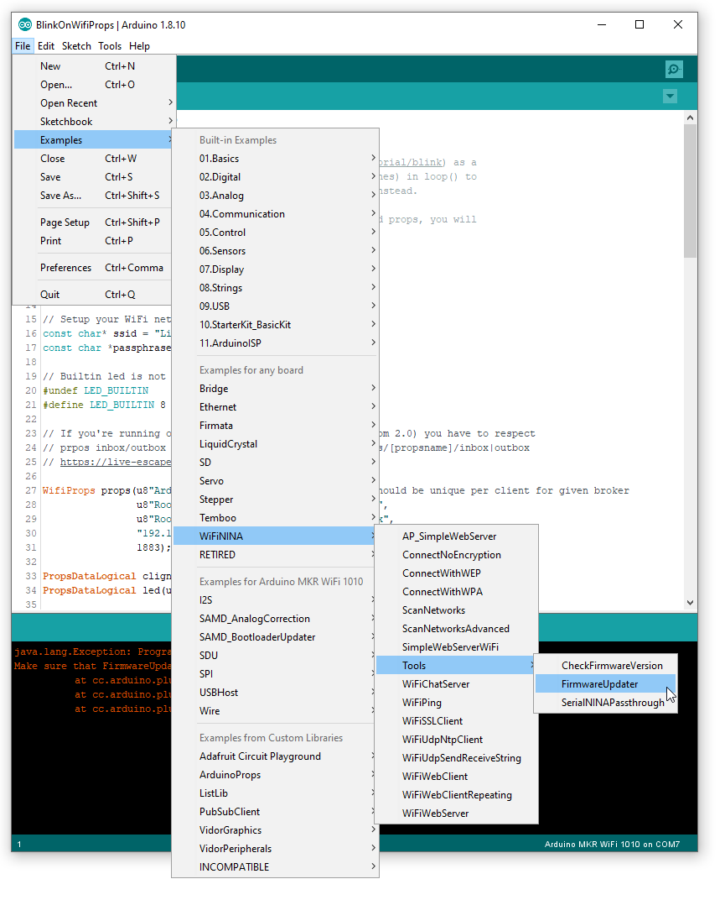
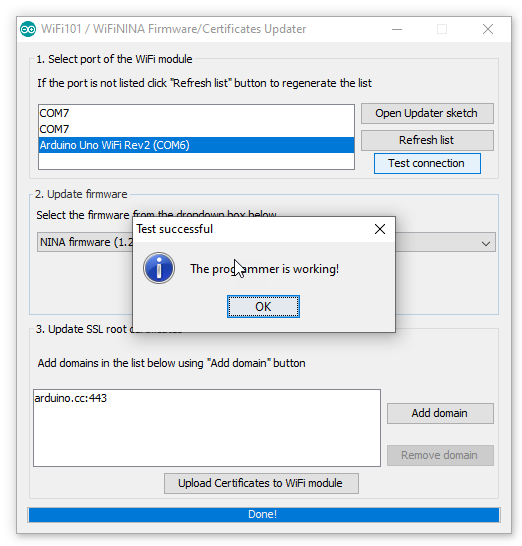
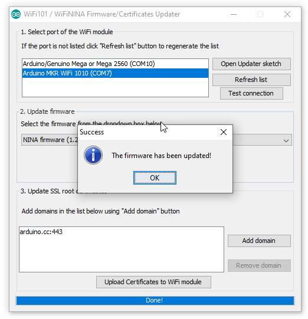

# *WiFiNINA* firmware update

Nowadays, fall 2019, we still receive *WiFiNINA* arduinos with firmware 1.0.0.0 version (Arduino Uno WiFi Rev 2, Arduino NANO 33 IoT, Arduino MKR WiFi 1010, Arduino MKR VIDOR 4000).

***It is highly recommended to update *WiFiNINA* firmware to latest version.***

## Known issue with 1.0.0.0 version
`WiFi.config()` does not work, we can't set static IP address.

That's a very good reason to update the firmware.

## Update *WiFiNINA* firmware how-to
1. Upload *FirmwareUpdater* sketch
2. Open **WiFi101 / WiFiNINA Firmware Updater**
3. Test board connection
4. Update *WiFiNINA* firmware 

### 1. Upload *FirmwareUpdater* sketch

Load the *FirmwareUpdater* sketch from **File > Examples > WiFiNINA > Tools > FirmwareUpdater**

### 2. Open *WiFi101 / WiFiNINA Firmware Updater*

Open the firmware updater from **Tools > WiFi101 / WiFiNINA Firmware Updater**

### 3. Test board connection

Select the board port:

And click **Test connection**:

### 4. Update *WiFiNINA* firmware 

Select the latest firmware available and click **Update Firmware**:

Update process will take about a minute then you're done:

## Author

**Marie FAURE** (Nov 13th, 2019)
* company: FAURE SYSTEMS SAS
* mail: *dev at faure dot systems*
* github: <a href="https://github.com/fauresystems?tab=repositories" target="_blank">fauresystems</a>
* web: <a href="https://faure.systems/" target="_blank">Faure Systems</a>